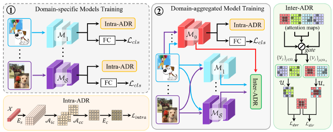

# Attention Diversification for Domain Generalization

This repo is the official implementation of ECCV2022 paper "Attention Diversification for Domain Generalization".

## Paper introduction



The pipeline of our proposed Attention Diversification framework, which is
composed of Intra-ADR and Inter-ADR.


## Preparation

**Prerequistes**

- Python 3.6
- Pytorch 1.5
- CUDA 8.0 or higher

## Usage
### Data Preparation
* **PACS**: Download data from website [PACS](https://dali-dl.github.io/project_iccv2017.html)
* **OfficeHome**: Download data from website [OfficeHome](https://www.hemanthdv.org/officeHomeDataset.html)
* **VLCS**: Download data from website [VLCS](https://drive.google.com/uc?id=1skwblH1_okBwxWxmRsp9_qi15hyPpxg8)
* **DomainNet**: Download data from website [DomainNet](http://ai.bu.edu/DomainNet/) and split-details from website [VISDA](https://github.com/prithv1/DMG/tree/master/data/DomainNet)

### Data folds structure
  ```shell
  .root/datasets/
    └── PACS/
    |      ├── art_painting
    |      |      └── ...
    |      ├── cartoon
    |      |      └── ...
    |      ├── photo
    |      |      └── ...
    |      ├── sketch
    |      |      └── ...
    |      ├── art_painting_crossval_kfold.txt
    |      ├── art_painting_test_kfold.txt
    |      ├── art_painting_train_kfold.txt
    |      ├── cartoon_crossval_kfold.txt
    |      └── ...
    └── officehome/
    |      ├── art
    |      |      ├── train
    |      |      |    └── ...
    |      |      └── val
    |      ├── clipart
    |      |      └── ...
    |      ├── product
    |      |      └── ...
    |      └── real_world
    |             └── ...
    └── VLCS/
    |      ├── CALTECH
    |      |      ├── crossval
    |      |      |    └── ...
    |      |      ├── full
    |      |      |    └── ...
    |      |      ├── test
    |      |      |    └── ...
    |      |      └── train
    |      |           └── ...
    |      ├── LABELME
    |      |      └── ...
    |      ├── PASCAL
    |      |      └── ...
    |      └── SUN
    |             └── ...
    └── DomainNet/
    |      ├── clipart
    |      |      └── ...
    |      ├── infograph
    |      |      └── ...
    |      ├── painting
    |      |      └── ...
    |      ├── quickdraw
    |      |      └── ...
    |      ├── real
    |      |      └── ...
    |      ├── sketch
    |      |      └── ...
    |      ├── clipart_test.txt
    |      ├── clipart_train.txt
    |      ├── clipart_val.txt
    |      ├── infograph_test.txt
    |      └── ...

    
  ```

### Train and Eval
To perform domain generalization in PACS, please run,
#### Intra-ADR

```bash
bash scripts/run_intra.sh PACS # PACS/officehome/VLCS/Domainnet
```
#### I2-ADR
1. Domain-specific models
```bash
bash scripts/run_intra_single.sh PACS  # PACS/officehome/VLCS/Domainnet
```
2. Domain-aggregated model
```bash
bash scripts/run_i2.sh PACS # PACS/officehome/VLCS/Domainnet
```

## Citation

Please consider citing our paper if you find it useful for your research.

```BibTeX
@inproceedings{meng2022attention,
    title={Attention Diversification for Domain Generalization},
    author={Rang Meng, Xianfeng Li, Weijie Chen, Shicai Yang, Jie Song, Xinchao Wang, Lei Zhang, Mingli Song, Di Xie, Shiliang Pu},
    booktitle={European Conference on Computer Vision (ECCV)},
    year={2022},
}
```

## License

This project is released under the [Apache 2.0 license](./LICENSE). Other codes from open source repository follows the original distributive licenses.

## Acknowledgement

We would like to appreciate for the excellent work of [JigenDG](https://github.com/fmcarlucci/JigenDG) and [RSC](https://github.com/DeLightCMU/RSC) which lay a solid foundation for our work. If you have any question about this work, please feel free to contact Rang Meng (mengrang-at-hikvision.com) and Xianfeng Li (lixianfeng6-at-hikvision.com).